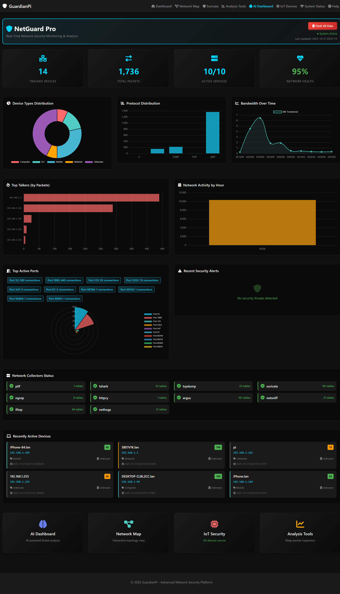
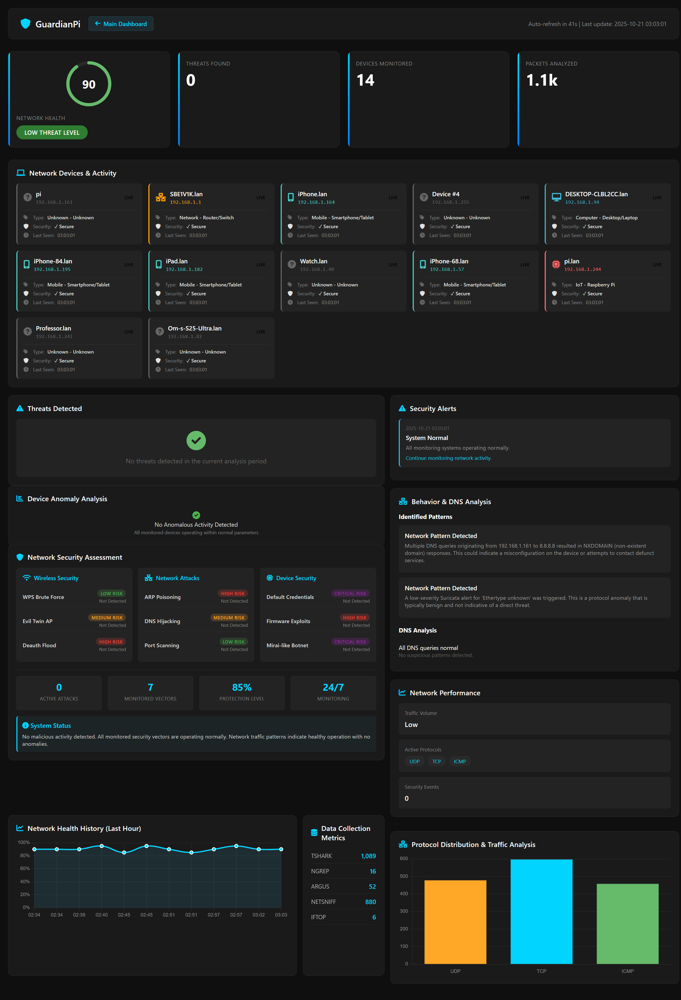
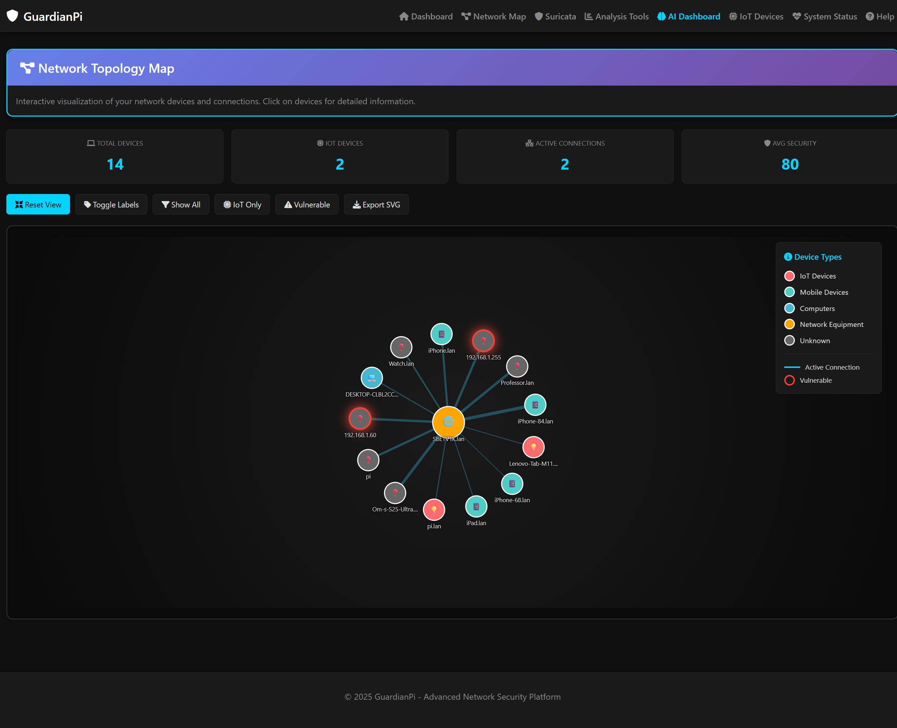
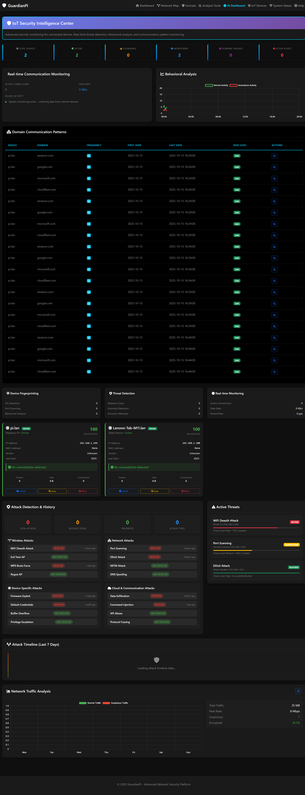
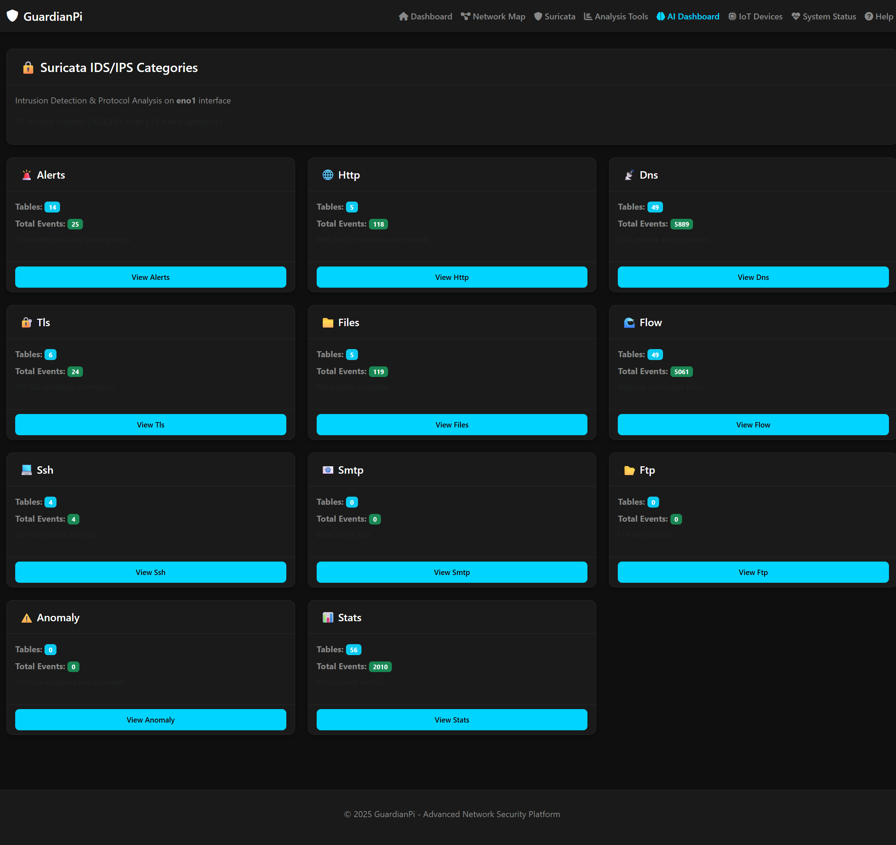
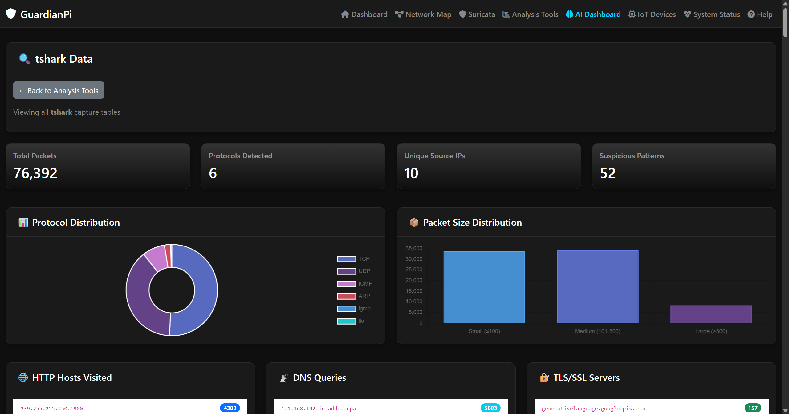

# 🛡️ NetGuard Pro

[](https://opensource.org/licenses/MIT)
[](https://www.python.org/downloads/)
[](https://flask.palletsprojects.com/)
[](https://github.com/bunnyhp/netguard-pro)

> **Professional-grade network security monitoring platform** that integrates 10 specialized tools to provide complete visibility into network traffic, detect security threats, and deliver actionable insights through an intuitive web dashboard.


*Main Dashboard - Real-time network monitoring and security analysis*

---

## 📋 Table of Contents

- [Features](#-features)
- [Screenshots](#-screenshots)
- [Quick Start](#-quick-start)
- [Installation](#-installation)
- [Configuration](#-configuration)
- [Usage](#-usage)
- [Architecture](#-architecture)
- [Dashboard Features](#-dashboard-features)
- [Contributing](#-contributing)
- [License](#-license)
- [Disclaimer](#-disclaimer)

---

## ✨ Features

### 🔍 Network Monitoring & Analysis
- **Multi-Interface Monitoring**: Captures traffic across multiple network interfaces simultaneously
- **Zero Packet Loss Architecture**: Optimized for high-performance packet capture
- **Real-Time Threat Detection**: Suricata IDS integration with 45,000+ detection rules
- **10 Specialized Tools**: Comprehensive analysis using industry-standard tools
  - **tcpdump** - Raw packet capture and analysis
  - **Suricata** - IDS/IPS with protocol analysis and threat detection
  - **tshark** - Protocol dissection and deep packet inspection
  - **p0f** - Passive OS fingerprinting
  - **argus** - Network flow analysis and connection tracking
  - **ngrep** - Pattern matching and content inspection
  - **netsniff-ng** - High-performance zero-copy capture
  - **httpry** - HTTP traffic logging and analysis
  - **iftop** - Real-time bandwidth monitoring per connection
  - **nethogs** - Per-process bandwidth usage tracking

### 🤖 AI-Powered Security
- **AI Threat Analysis**: Automated threat detection using AI models
- **Device Classification**: Intelligent device identification and categorization
- **Anomaly Detection**: Machine learning-based anomaly detection
- **Behavioral Analysis**: Pattern recognition for suspicious activities

### 🏠 IoT Security Framework
- **Device Identification**: Automatic IoT device discovery and classification
- **Vulnerability Detection**: Scanning for known vulnerabilities
- **Security Scoring**: Risk assessment for each device (0-100 scale)
- **Threat Detection**: Real-time monitoring for IoT-specific attacks

### 📊 Professional Dashboard
- **Modern Web Interface**: Bootstrap 5 + DataTables for advanced visualization
- **Real-Time Updates**: Live data refresh with auto-update functionality
- **Interactive Charts**: Multiple visualization types (line, bar, donut, radial charts)
- **Network Topology**: Interactive D3.js network map visualization
- **Responsive Design**: Mobile-friendly interface

### 🔄 Automated Pipeline
- **Continuous Capture**: 24/7 network traffic monitoring
- **Automated Processing**: Data conversion from raw captures to structured format
- **SQLite Storage**: Timestamped tables for efficient data management
- **Systemd Integration**: Automatic service management and monitoring

---

## 📸 Screenshots

### Main Dashboard

*Comprehensive overview showing network health (90%), tracked devices (14), threats detected (0), and packets analyzed (1.1k). Features device cards, network health history chart, protocol distribution, and data collection metrics.*

### AI Dashboard

*AI-powered threat analysis dashboard displaying tracked devices (14), total packets (1,736), active services (10/10), and network health (95%). Includes device type distribution, top talkers, protocol distribution, bandwidth over time, and network activity charts.*

### Network Topology Map

*Interactive D3.js network visualization showing 14 devices connected to central router (SBETVIK.lan). Displays device types (IoT, Mobile, Computer, Network Equipment), active connections, vulnerable devices (red outline), and includes filter options (Show All, IoT Only, Vulnerable).*

### IoT Devices View

*IoT device monitoring interface showing device cards with security status, device types, IP addresses, last seen timestamps, and security assessments. Features threat detection, anomaly analysis, and network security assessment panels.*

### Suricata IDS/IPS Categories

*Suricata intrusion detection dashboard displaying 11 event categories: Alerts (25 events), HTTP (118 events), DNS (5,889 events), TLS (24 events), Files (119 events), Flow (5,061 events), SSH (4 events), SMTP (0), FTP (0), Anomaly (0), and Stats (2,010 events).*

### Tshark Data Analysis

*Tshark protocol dissection dashboard showing packet analysis, protocol breakdown, and deep packet inspection results.*

> **Note**: To add screenshots, save your PNG images to `docs/screenshots/` directory with the filenames shown above. Recommended size: 1920x1080 or 1280x720 for optimal display.

---

## 🚀 Quick Start

### Prerequisites

- **Linux System** (Ubuntu/Debian recommended)
- **Python 3.8+**
- **Root/sudo access** for packet capture
- **Network monitoring tools** (see installation section)

### Installation

1. **Clone the repository**
   ```bash
   git clone https://github.com/bunnyhp/netguard-pro.git
   cd netguard-pro
   ```

2. **Run the setup script**
   ```bash
   chmod +x setup.sh
   ./setup.sh
   ```

3. **Install Python dependencies**
   ```bash
   pip3 install -r requirements.txt
   ```

4. **Initialize the database**
   ```bash
   cd NetGuard
   python3 scripts/init_database.py
   ```

5. **Configure AI features** (optional)
   ```bash
   cp config/ai_config.json.template config/ai_config.json
   # Edit config/ai_config.json and add your API keys
   ```

6. **Start services**
   ```bash
   sudo cp services/*.service /etc/systemd/system/
   sudo systemctl daemon-reload
   sudo systemctl start network-dashboard.service
   ```

7. **Access the dashboard**
   ```
   http://localhost:8080
   ```

For detailed installation instructions, see [NetGuard/README.md](NetGuard/README.md) or [NetGuard/QUICKSTART.md](NetGuard/QUICKSTART.md).

---

## ⚙️ Configuration

### Environment Variables

```bash
# Database path
export NETGUARD_DB_PATH="/path/to/network.db"

# Web server configuration
export NETGUARD_WEB_HOST="0.0.0.0"
export NETGUARD_WEB_PORT="8080"

# Network interfaces
export NETGUARD_INTERFACE_PRIMARY="eth0"
export NETGUARD_INTERFACE_WIFI="wlan0"
export NETGUARD_INTERFACE_USB_WIFI="wlan1"
```

### Configuration File

Edit `NetGuard/config.py` to customize paths and settings:

```python
# Database configuration
DB_PATH = os.getenv('NETGUARD_DB_PATH', str(PROJECT_ROOT / "network.db"))

# Web configuration
WEB_HOST = os.getenv('NETGUARD_WEB_HOST', '0.0.0.0')
WEB_PORT = int(os.getenv('NETGUARD_WEB_PORT', '8080'))
```

---

## 🎯 Usage

### Dashboard Endpoints

- **Main Dashboard**: `http://localhost:8080/`
- **AI Dashboard**: `http://localhost:8080/ai-dashboard`
- **Network Topology**: `http://localhost:8080/network-topology`
- **IoT Devices**: `http://localhost:8080/iot-devices`
- **Security Alerts**: `http://localhost:8080/alerts`
- **Suricata Analysis**: `http://localhost:8080/suricata`
- **Analysis Tools**: `http://localhost:8080/analysis`
- **System Status**: `http://localhost:8080/system-status`

### Service Management

```bash
# Start all services
sudo systemctl start network-capture.service
sudo systemctl start network-dashboard.service

# Check service status
sudo systemctl status network-dashboard.service

# View logs
sudo journalctl -u network-dashboard.service -f
```

### Database Access

```bash
# Connect to database
sqlite3 NetGuard/network.db

# List all tables
.tables

# Query recent data
SELECT * FROM network_20251021_120000 LIMIT 10;
```

---

## 🏗️ Architecture

### System Architecture

```
Network Traffic
    ↓
Capture Tools (10 tools across interfaces)
    ↓
Raw Capture Files (PCAP, logs)
    ↓
Conversion Scripts (Python)
    ↓
SQLite Database (Timestamped Tables)
    ↓
Flask Web Server (Port 8080)
    ↓
Web Dashboard (Browser)
```

### Data Flow

1. **Capture Layer**: Network tools capture traffic from interfaces
2. **Processing Layer**: Python scripts convert raw data to JSON
3. **Storage Layer**: Data stored in SQLite with timestamped tables
4. **Presentation Layer**: Flask serves data via REST API
5. **Visualization Layer**: Web dashboard displays interactive charts

### Directory Structure

```
netguard-pro/
├── NetGuard/                  # Main application
│   ├── config/               # Configuration files
│   │   ├── ai_config.json.template
│   │   ├── alert_rules.json
│   │   ├── iot_signatures.json
│   │   └── known_devices.json
│   ├── configs/              # Suricata configuration
│   ├── scripts/              # Python processing scripts
│   │   ├── init_database.py
│   │   ├── *_collector.py    # Data collectors
│   │   └── ...
│   ├── services/             # Systemd service files
│   ├── web/                  # Flask web application
│   │   ├── app.py
│   │   └── templates/
│   ├── captures/             # Network captures (gitignored)
│   └── logs/                 # System logs (gitignored)
├── thesis/                   # Research paper materials
├── docs/                     # Documentation
│   └── screenshots/          # Dashboard screenshots
├── LICENSE
├── README.md
├── CONTRIBUTING.md
└── requirements.txt
```

---

## 📊 Dashboard Features

### Main Dashboard

- **Network Health**: Real-time health score (0-100%)
- **Tracked Devices**: Number of devices being monitored
- **Threat Detection**: Active threats and security alerts
- **Packet Analysis**: Total packets analyzed
- **Device Cards**: Visual cards for each monitored device
- **Charts & Visualizations**:
  - Device types distribution (donut chart)
  - Protocol distribution (bar chart)
  - Bandwidth over time (line chart)
  - Top talkers (horizontal bar chart)
  - Network activity by hour (bar chart)
  - Port activity (radial chart)

### AI Dashboard

- **AI Threat Analysis**: Automated threat assessment
- **Network Patterns**: Behavioral pattern detection
- **Anomaly Detection**: Unusual activity identification
- **DNS Analysis**: DNS query pattern analysis
- **Security Recommendations**: AI-generated security suggestions

### Network Topology Map

- **Interactive Visualization**: D3.js force-directed graph
- **Device Relationships**: Visual connection mapping
- **Color-Coded Nodes**: Device type identification
- **Click for Details**: Device information panel
- **Filter Options**: IoT only, vulnerable devices, etc.
- **Export Functionality**: SVG export capability

### IoT Devices View

- **Device Discovery**: Automatic IoT device identification
- **Security Scoring**: Risk assessment per device
- **Vulnerability Detection**: Known vulnerability scanning
- **Traffic Analysis**: Per-device traffic monitoring
- **Threat Detection**: IoT-specific attack detection

### Security Alerts

- **Real-Time Alerts**: Live security notifications
- **Severity Levels**: CRITICAL, HIGH, MEDIUM, LOW
- **Auto-Remediation**: Automatic threat response
- **Alert History**: Historical alert tracking
- **Filter & Search**: Advanced alert filtering

---

## 🤝 Contributing

Contributions are welcome! Please read our [Contributing Guidelines](CONTRIBUTING.md) for details.

### How to Contribute

1. Fork the repository
2. Create a feature branch (`git checkout -b feature/amazing-feature`)
3. Commit your changes (`git commit -m 'Add amazing feature'`)
4. Push to the branch (`git push origin feature/amazing-feature`)
5. Open a Pull Request

### Development Setup

```bash
# Clone your fork
git clone https://github.com/yourusername/netguard-pro.git
cd netguard-pro

# Install dependencies
pip3 install -r requirements.txt

# Make changes and test
# Submit a pull request
```

---

## 📝 License

This project is licensed under the MIT License - see the [LICENSE](LICENSE) file for details.

---

## ⚠️ Disclaimer

**This software is for educational and authorized network monitoring purposes only.**

- Users are responsible for ensuring compliance with local laws and regulations
- Only monitor networks you own or have explicit permission to monitor
- Respect privacy and data protection regulations
- Do not use this software for unauthorized network access or surveillance

**The authors and contributors are not responsible for any misuse of this software.**

---

## 📚 Documentation

- [Complete Documentation](NetGuard/README.md)
- [Quick Start Guide](NetGuard/QUICKSTART.md)
- [Contributing Guidelines](CONTRIBUTING.md)
- [Open Source Preparation](OPEN_SOURCE_PREP.md)

---

## 🙏 Acknowledgments

- Open-source community for monitoring tools (tcpdump, Suricata, tshark, etc.)
- Flask team for the excellent web framework
- Bootstrap and DataTables for UI components
- D3.js for network visualization
- All contributors and users of NetGuard Pro

---

## 📞 Support

- **Issues**: [GitHub Issues](https://github.com/bunnyhp/netguard-pro/issues)
- **Discussions**: [GitHub Discussions](https://github.com/bunnyhp/netguard-pro/discussions)

---

<div align="center">

**Made with ❤️ for network security professionals**

[⭐ Star this repo](https://github.com/bunnyhp/netguard-pro) | [🐛 Report Bug](https://github.com/bunnyhp/netguard-pro/issues) | [💡 Request Feature](https://github.com/bunnyhp/netguard-pro/issues)

</div>
